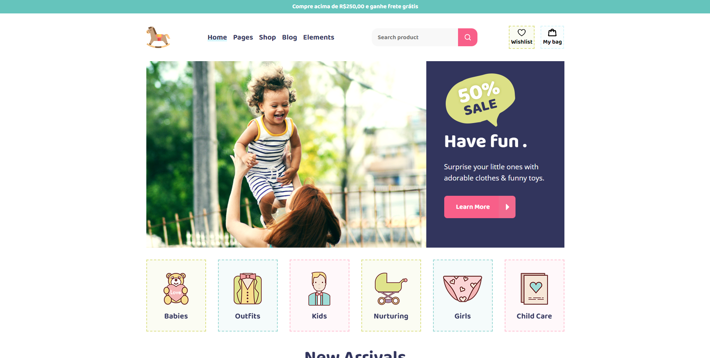
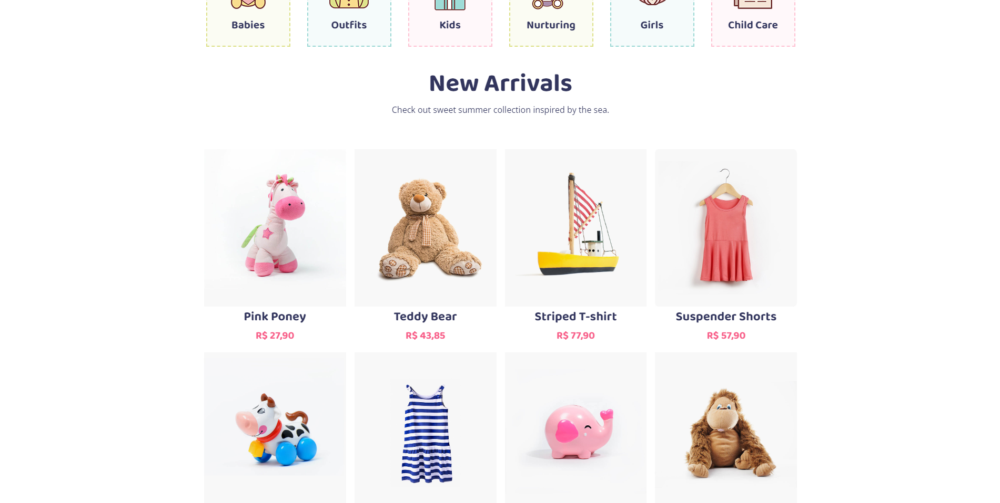
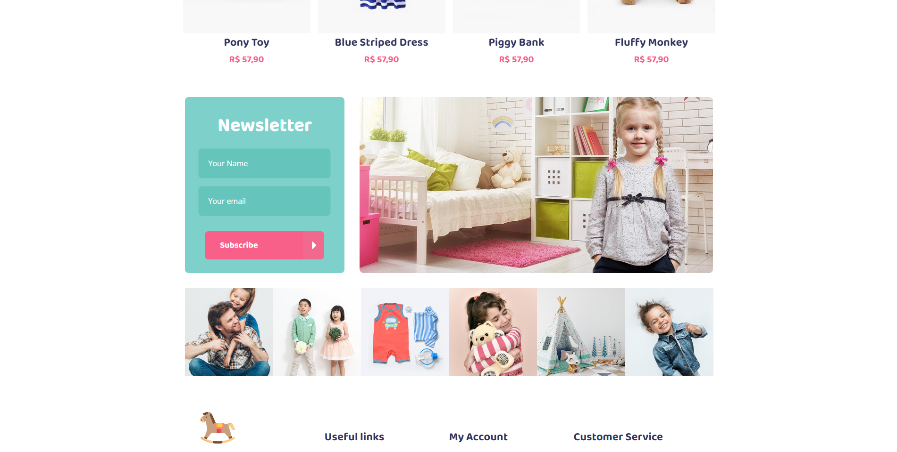
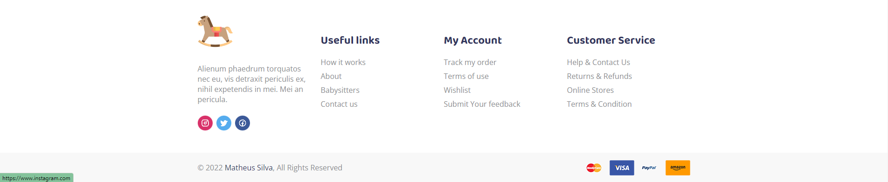
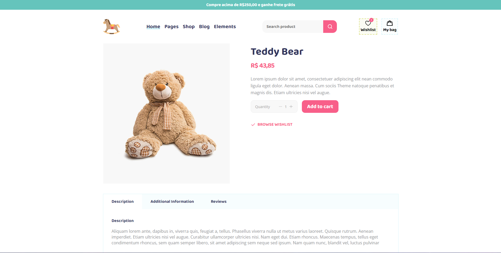
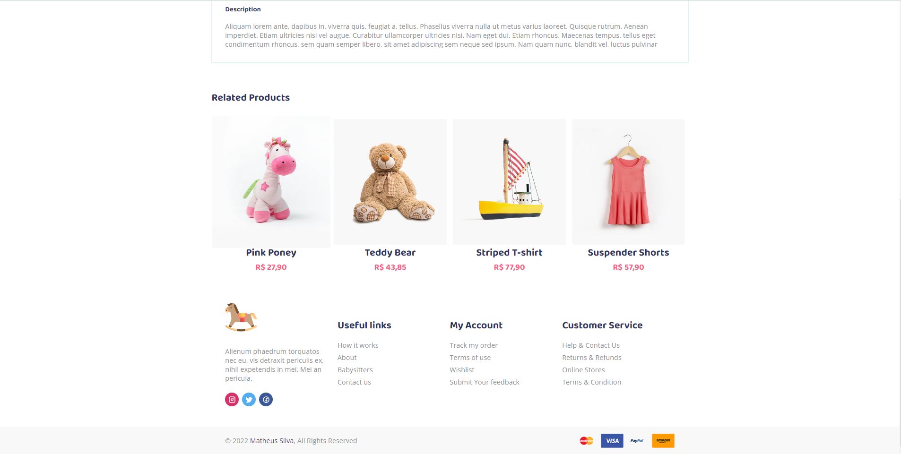
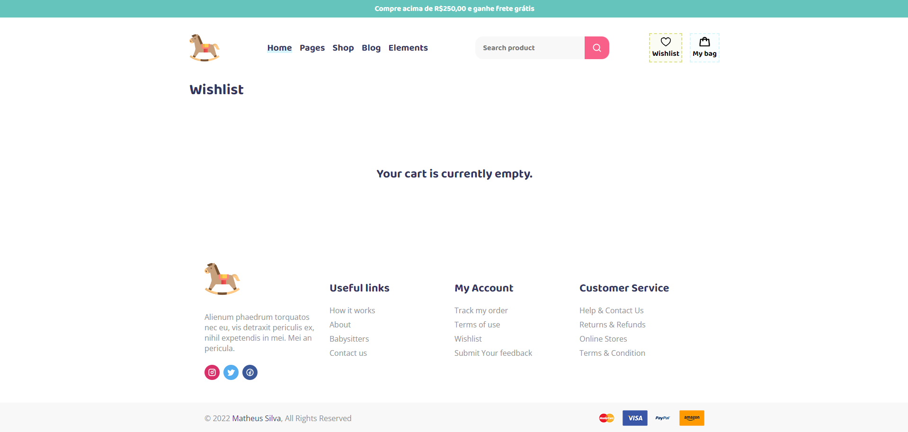
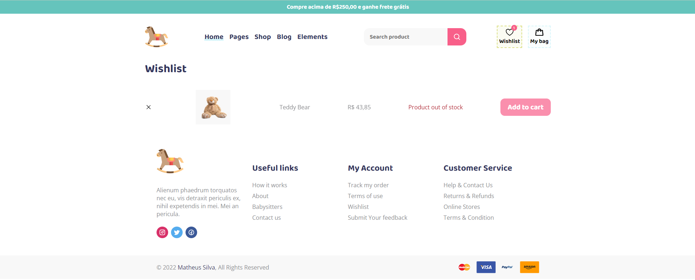
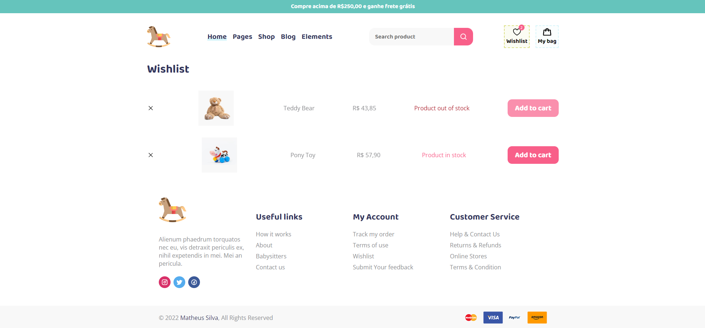
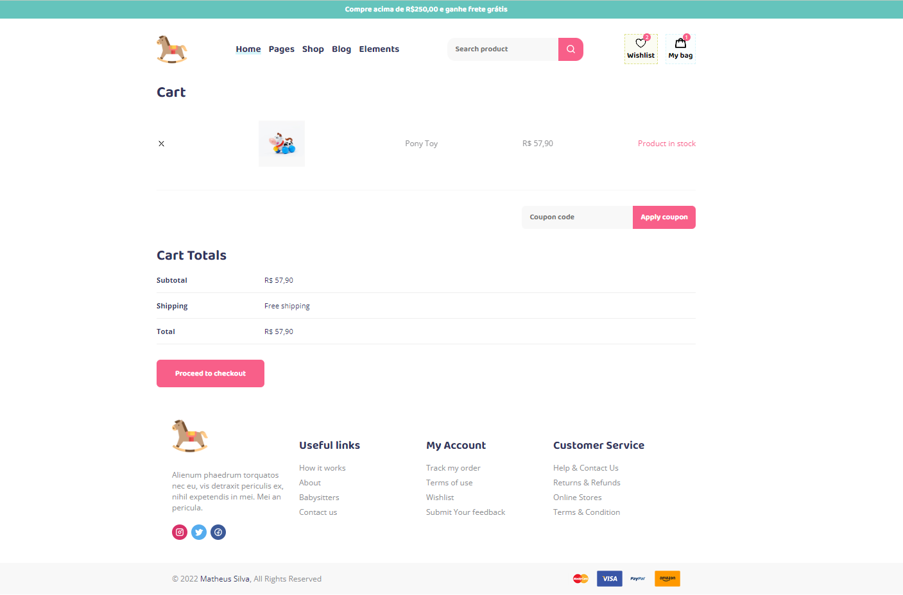

# Baby E-commerce

Projeto em React + Typescript.

### Objetivo
Apresentar produtos através do back-end "fake" em JSON-SERVER, realizar o armazenamento de seu Cart e Wishlist em localStorage, realizar busca pelo produto na barra de pesquisa e encaminhar página de checkout/sucesso do pedido!

### Imagens

#### Observação
O armazenamento dos produtos está sendo feito através do JSON-SERVER com os dados disponíveis na pasta src/database/data.json

### Instação
- `npm i`

* Necessário possuir o JSON-SERVER, consulte https://www.npmjs.com/package/json-server para mais informações.

### Para rodar
- `npm run dev`
- `npm run server`
